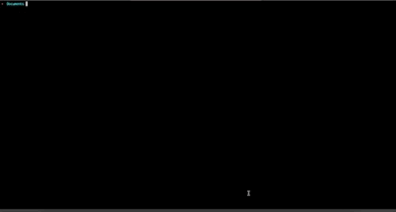

# Container Registry Explorer

A terminal user interface (TUI) tool for exploring and managing private container registries. Navigate through your container images, view available tags, and pull images directly from your terminal.



## Features

- **Browse Repositories**: View all image repositories in your private container registry
- **Explore Tags**: See all available tags for each repository
- **Pull Images**: Pull specific images directly from the TUI
- **Copy SHA**: Easily copy image SHA digests to your clipboard
- **Docker Credentials**: Automatically uses your existing Docker credentials for authentication
- **Fast Navigation**: Intuitive keyboard-driven interface for quick navigation

## Prerequisites

- Go 1.21 or higher (for building from source)
- Docker CLI installed and configured
- Access to a private container registry

## Installation

### From Source

```bash
# Clone the repository
git clone https://github.com/telday/container-registry-explorer.git
cd container-registry-explorer

# Build the binary
go build -o bin/explorer ./cmd/explorer

# (Optional) Install to your PATH
sudo mv bin/explorer /usr/local/bin/container-registry-explorer
```

### Using Go Install

```bash
go install github.com/telday/container-registry-explorer/cmd/explorer@latest
```

## Usage

### Authentication

Before using the explorer, authenticate with your container registry using Docker:

```bash
docker login <registry-url>
```

For example:
```bash
docker login registry.example.com
docker login gcr.io
docker login my-company-registry.azurecr.io
```

The explorer will automatically use these stored credentials.

### Running the Explorer

```bash
# Basic usage
explorer <registry-url>

# Examples
explorer registry.example.com
explorer gcr.io/my-project
explorer my-registry.azurecr.io
```

**Note**: The public Docker Hub registry is not supported. This tool is designed specifically for private container registries.

## Configuration

The explorer uses your Docker configuration located at `~/.docker/config.json` for registry authentication. No additional configuration is required.

## Troubleshooting

### Authentication Issues

If you encounter authentication errors:

1. Ensure you've logged in to the registry:
   ```bash
   docker login <registry-url>
   ```

2. Verify your credentials are stored:
   ```bash
   cat ~/.docker/config.json
   ```

3. Test Docker access:
   ```bash
   docker pull <registry-url>/<some-image>
   ```

### Connection Issues

- Verify you have network access to the registry
- Check if your registry URL is correct
- Ensure the registry supports the Docker Registry HTTP API V2

## Contributing

Contributions are welcome, please feel free to submit a Pull Request!